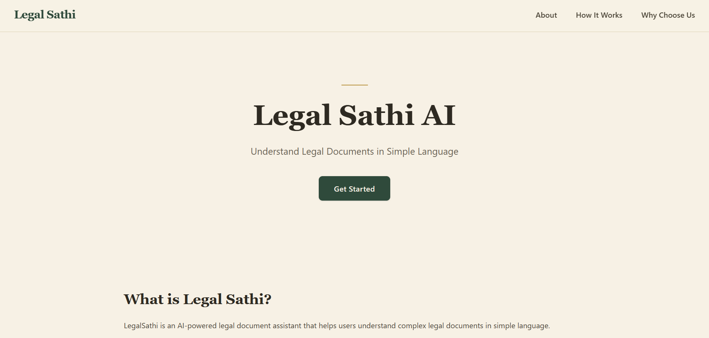
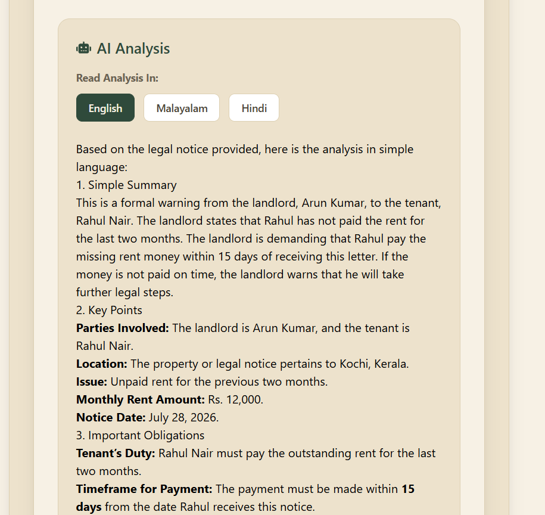
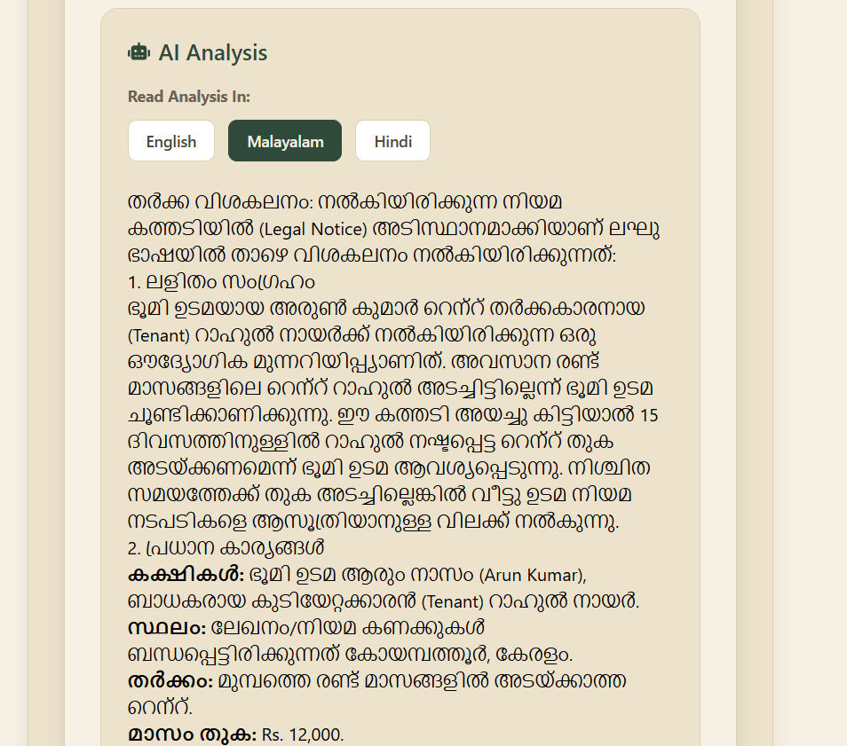

# ⚖️ Legal Sathi AI

Legal Sathi AI is an AI-powered legal document assistant that helps users understand complex legal documents in simple, easy-to-understand language.

Users can upload PDF or image documents, and the application extracts the text, analyzes it using AI, simplifies complex legal terminology, and provides explanations in multiple languages.

---

# 🌐 Live Demo

https://legal-sathi-v2.vercel.app/

---

# ✨ Features

- 📄 Upload legal documents in PDF or image format
- 👁️ AI-powered OCR for scanned PDFs and images
- 📑 Text extraction from digital PDFs using PyMuPDF
- 🤖 AI-powered legal document analysis
- 📝 Converts complex legal language into simple, easy-to-understand explanations
- 🌍 Multi-language support (English, Malayalam, and Hindi)
- ⚡ Fast document processing
- 🔒 Secure document handling

---

# 🛠️ Tech Stack

## Frontend

- React.js
- Vite
- Tailwind CSS
- React Router
- Axios
- React Markdown

## Backend

- Django
- Django REST Framework
- Groq API (LLaMA 3.3 70B)
- PyMuPDF
- Pillow
- Python-dotenv

---

# 📂 Project Structure

```text
LegalSathi-v2/
│
├── backend/
│   ├── core/
│   ├── documents/
│   ├── manage.py
│   └── requirements.txt
│
├── frontend/
│   ├── src/
│   ├── public/
│   ├── package.json
│   └── vite.config.js
│
└── README.md
```

---

## 🚀 How It Works

1. Upload a legal document (PDF or Image).

2. Extract text from the uploaded document:
   - Digital PDFs → **PyMuPDF**
   - Scanned PDFs & Images → **Vision AI**

3. Analyze the extracted content using a Large Language Model (LLM).

4. Convert complex legal terminology into simple English.

5. Translate the simplified explanation into English, Malayalam, or Hindi.

---

### 🌍 Multi-language Support

The AI first generates a simplified English explanation of the legal document.

Users can then choose their preferred language:

- 🇬🇧 English
- 🇮🇳 Hindi
- 🇮🇳 Malayalam

Translations are generated on demand using AI and are usually available within a few seconds.

> **Note:** AI-generated translations may vary slightly depending on the document. For legal accuracy, always refer to the original legal document.

---

## 📸 Screenshots

### 🏠 Home Page



### 📤 Upload Page


### 🤖 AI Analysis



### 🌍 Translation



---

## ⚙️ Installation

### Clone Repository

```bash
git clone https://github.com/A-adilajaleel/LegalSathi-V2.git
```

### Backend

```bash
cd backend

python -m venv venv

venv\Scripts\activate

pip install -r requirements.txt

python manage.py migrate

python manage.py runserver
```

### Frontend

```bash
cd frontend

npm install

npm run dev
```

---

## 🔑 Environment Variables

Create a `.env` file inside the backend directory.

```
GROQ_API_KEY=your_groq_api_key
```

---

## Future Improvements


- 🔍 Legal Risk Detection
- 📄 Download AI-Generated Reports
- 👤 User Authentication & Dashboard
- 📂 Document History

---

## 👩‍💻 Author

**Adila Jaleel**

GitHub:
https://github.com/A-adilajaleel

---

## 📄 License

This project is created for educational and portfolio purposes.
